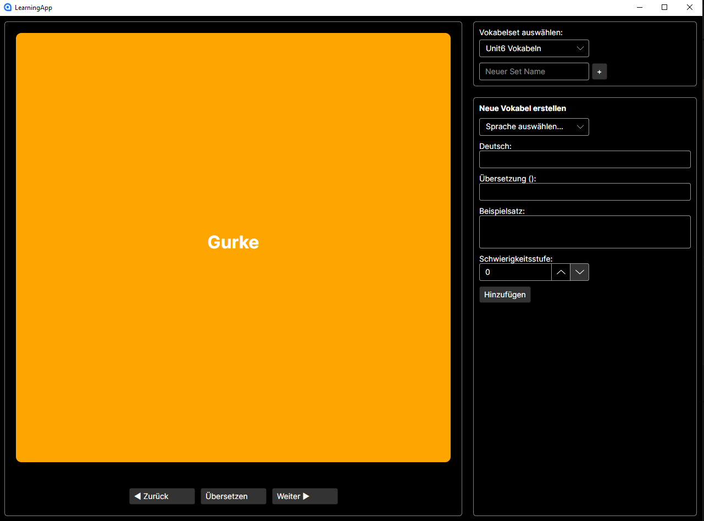
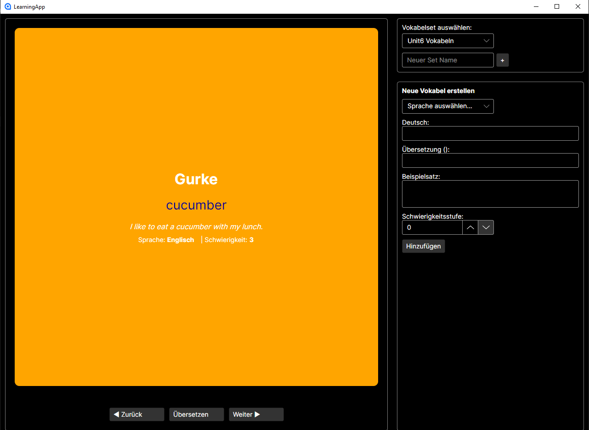

## Specification

#### Motivation

Es gibt viele Vokabeltrainer, aber die meisten stecken hinter Paywall oder Key features stecken hinter einer Paywall. 
Ein weiteres Problem ist die Unkompaktheit.

Mein Ziel war es deshalb einen Vokabeltrainer zu entwerfen der kompakt ist und alle features auf einen Überblick bereitstellt und 100% gratis ist.

#### Zielgruppe

Mein Vokalbetrainer ist natürlich kein Ersatz für etablierte Vokabeltrainer wie z.B. Quizlet, tatsächlich stellt er jedoch eine schnelle und einfache Möglichkeit dar,
unkompliziert und einfach Vokabel zu lernen.

Die Zielgruppe sind deshalb vor allem Schüler, die selten Vokabel lernen müssen, wie HTL-Schüler. Und kein riesiges Feature Set brauchen, sondern nur eine schnelle, einfache 
Trainer.

#### Feature Set / Worklfow

Der Vokalbeltrainer sollte folgende Features zur Verfügung stellen:

1. Vokabelsets frei erstellen
2. Vokabeln mit: - oringinales deutsches Wort
                 - Übersetzung
                 - Beispielsatz
                 - Schwierigkeitsgrad
                
erstellen und einem Vokalbest hinzufügen.

3. Vokabeln in Übersicht durchklicken und lernen.

####  Design

Es wurden schon mehrere Vokabeln erstellt die dargestellt werden.

Klickt man auf übersetzten werden, die Informationen dargestellt.

